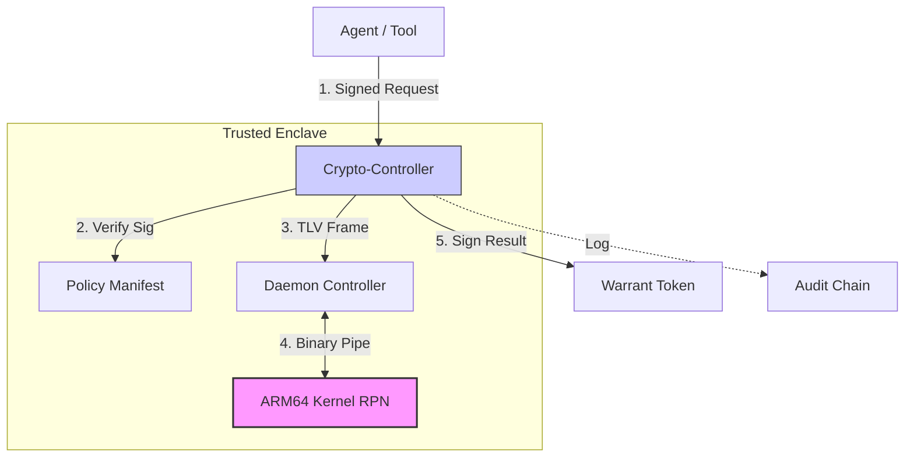
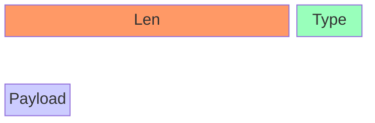

# Constable Governance Kernel (ARM64 RPN)

> **"Mechanical Trust" for the Age of Agents.**

**LLMs are non-deterministic. Authorization must not be.**

This project implements a high-performance **Governance Kernel** using a custom ARM64 assembly RPN calculator. It functions as a deterministic policy oracle, providing transparent, mechanically verifiable "Proof of Decision" for AI agents.

By offloading policy enforcement to this isolated, mathematically pure kernel, we eliminate LLM hallucination from the critical path of authorization. It is not just a calculator; it is a **Minimal Constitution for Machines**.

---

## ⚡ Performance: The Speed Upgrade
- **Latency**: **0.11ms** per check (Refactored to Persistent Daemon).
- **Throughput**: >8000 checks/sec.
- **Micro-Architecture**: The kernel runs as a background daemon, communicating via a persistent pipe (`stdin/stdout`) managed by a Python Controller. This eliminates the ~30ms process fork overhead.

---

## 🏛️ Architecture: "The Zero-Knowledge Authority"

The system operates as a 3-layer stack, treating the Assembly Kernel as a zero-knowledge logic gate wrapped in a cryptographic enforcement layer.



### 1. The Kernel (`rpn.s`) - "Zero Knowledge Logic"
A pure ARM64 assembly program. It doesn't know *who* you are, only that the math checks out.
- **Stateless**: Stack pointer resets to `x24` snapshot after every command.
- **Pure**: No IO, no network, no file access.

### 2. The Daemon (`governance.py`) - "The Pipe"
Manages the persistent process lifecycle and translates high-level context into RPN expressions.
- **Controller**: Auto-restarts the kernel if it crashes.
- **Traceability**: naming clauses allows for "Actionable Counterfactuals" (Trace).
- **Composable Logic**: Clauses can reference previous clauses (e.g., `{tier_1} {one_sig} &`) enabling chained reasoning.

### 3. The Crypto-Controller (`crypto_governance.py`) - "The Enforcer"
Wraps the Daemon in a secure cryptographic envelope.
- **Signed Manifests**: Policies are loaded from `policies.json`, signed by an offline **Root Key**.
- **Merkle Logger**: Decisions are logged to `audit.chain`, an append-only hash chain.
- **The Warrant**: Successful verification returns a cryptographically signed `Warrant` (Ed25519) that tools must verify before execution.

### 4. Real-World Proof: Autonomous SOC
We implemented a **Constitutional Security Operations Center** to demonstrate "Intelligence Upstream of Authority."
- **Sensors** & **Investigators** (Agents) can propose actions.
- **Constable** (Kernel) enforces the Rules of Engagement.

**The Policy (`SOCMatrix`)**:
1.  **Low Risk** (`Sev < 30`): Auto-Approved.
2.  **High Risk** (`Sev >= 70`): Requires **Dual Signatures** (Investigator + Human).
3.  **Kill Switch** (`Sev >= 95`): **Auto-Deny** (No exceptions).

**The Simulation**:
```text
[Scenario] Severity 82 (High). Investigator acts alone.
[Constable] DENIED. Trace: {'high_risk': False} -> Missing Human Sig.

[Scenario] Severity 82. Investigator + Human Co-Sign.
[Constable] GRANTED. Warrant Issued.

[Scenario] Severity 99. Kill Switch Triggered.
[Constable] DENIED. Constraint 'kill_switch' override.
```

[Scenario] Severity 99. Kill Switch Triggered.
[Constable] DENIED. Constraint 'kill_switch' override.
```

### 5. Constitutional Incident Response (Competing Agents)
Demonstrates coordination failure and recovery under shared constraints.
**The Conflict**: "Containment" wants to isolate; "Continuity" wants uptime.
**The Resolution**:
1.  **Severity 76**: Continuity refuses to sign. Constable **DENIES** Containment's solo request.
2.  **Consensus**: Containment proves threat. Continuity signs. Constable **GRANTS**.
3.  **Constitution**: Severity 99. Even with Human signature, Constable **DENIES** (Kill Switch).

> "Agents cannot collude without satisfying math."

### Threat Model & Trust Boundaries
| Component          | Trust Level      | Responsibility        | Risks Assumed                                        |
| :----------------- | :--------------- | :-------------------- | :--------------------------------------------------- |
| **Agent / LLM**    | **Untrusted**    | Intent & Planning     | Malicious, Confused, Non-Deterministic               |
| **Daemon**         | **Semi-Trusted** | Transport & Lifecycle | Denial of Service (Crash), but cannot forge Warrants |
| **Kernel**         | **Trusted**      | Logic & Arithmetic    | Correct Implementation, Deterministic Execution      |
| **Constable Keys** | **Trusted**      | Signing Warrants      | Must be kept secret (Hardware Module ideal)          |

> **Note**: Side-channel attacks on the ARM64 kernel are currently out of scope. The kernel assumes the host OS enforces standard process isolation.

---

## 🤖 Multi-Agent Integration
Constable includes "Iron Proxy" wrappers for major agent frameworks, intercepting tool calls before they execute.

| Framework     | Module                  | Description               |
| :------------ | :---------------------- | :------------------------ |
| **LangChain** | `governed_langchain.py` | `StructuredTool` consumer |
| **LangGraph** | `governed_langgraph.py` | Graph State Checkpoint    |
| **AutoGen**   | `governed_autogen.py`   | Function Decorator        |

### Example: The Reasoning Loop (Actionable Counterfactuals)
Constable doesn't just deny actions; it provides **traceable counterfactuals** that allow agents to self-correct.

```text
[Agent] Action: DELETE_FILE
[Constable] DENIED. Trace: {'is_admin': False}
[Agent] ... "I see. The predicate 'is_admin' failed. I must escalate permissions or choose a safer action."
```
The trace serves as a feedback signal for the agent's planning loop, turning "Access Denied" into "Constraint Discovery".

---

## 🛠️ Usage & Operations

### Quick Start
```bash
# 1. Compile the Kernel
gcc -o rpn rpn.s

# 2. Generate Keys (First Time)
source .venv/bin/activate
python3 keygen.py

# 3. Sign Policy Manifest
python3 sign_policies.py

# 4. Run Secure Demo
python3 demo_crypto.py
```

### Policy Definition
Policies are defined in `registry.py` as RPN templates.
```python
STANDARD_ACCESS_POLICY = {
    "name": "StandardAccess",
    "clauses": {
        "is_admin": "{role_mask} 4 \"&\" 4 \"=\"",
        "is_safe_action": "{action_id} 200 \"<\""
    },
    "combination": "OR"
}
```

### The Ledger (Audit Chain)
All decisions are logged to `audit.chain` as a linked hash list.
```json
{"prev_hash": "a1b2...", "agent": "Agent_007", "decision": true, "curr_hash": "c3d4..."}
```

---

## 🔩 Technical Minutiae (ARM64 Kernel)

- **Registers**: Uses `x24` as a Safety Snapshot to prevent stack smashing. Uses `x28` as a Mode Flag (`0`=Daemon, `1`=Legacy).
- **Data Types**: Mixed Integer (64-bit) and Float (Double) support ("Bit-Blind" architecture).
- **Instruction Set**: Uses `adrp`/`add` for Position Independent Code (PIC) to access global string constants.

### 🔬 Deep Dive: Kernel Internals
1.  **Hybrid Number Parsing**: The kernel implements a custom dispatch logic for data entry:
    -   **Decimal Floats** (`3.14`): Detected by scanning for a `.` character. Handled via `strtod` to generate the correct IEEE-754 bit pattern.
    -   **Integers/Hex** (`42`, `0xFF`): Parsed via custom `atoi` logic.
    -   **Bit-Blind Operators**: Once on the stack, types vanish. The kernel treats all inputs as 64-bit words. `fadd` will interpret an integer `1` as `0.00...01` (denormalized float), not `1.0`.
    -   > **⚠️ SHARP EDGE**: The Kernel provides **NO TYPE SAFETY**. It is the responsibility of the Policy/Compiler to ensure operator alignment. `FADD`-ing two ASCII strings will produce deterministic garbage.
2.  **Syscall Directives**:
    -   `svc #0`: The only way into the OS. Used for `read` (3) and `write` (4).
    -   Registers `x0-x2` carry arguments; `x16` carries the syscall number.
3.  **Recursion**:
    -   The RPN calculator is valid for recursive expressions due to the stack structure, but the *Kernel Implementation* is iterative (`_read_loop`).
    -   Stack Depth is limited only by system memory (until `sp` hits the heap or unmapped page).

### Unified Test Suite
```bash
python3 run_all_tests.py
```
- **Kernel Regression**: 40/40 Unit Tests (Legacy Mode).
- **Integration**: Verifies Policy Logic & Daemon Reliability.

### 🔌 Transport Hardening (Binary Framing)
To prevent desynchronization attacks or "newline injection", the transport layer uses a **Length-Prefixed Binary Protocol (TLV)**.



- **Header (5 Bytes)**: 4B Length (Big Endian) + 1B Type (`0x01`=Exec).
- **Body**: UTF-8 Payload string.
- This guarantees strict message boundaries even under high throughput.

---


## 🛡️ Critical Surfaces & Mitigations
Security is enforced at multiple layers to prevent Denial of Service (DoS) and exhaustion attacks.

### 1. Daemon DoS (Rate Limiting)
**Risk**: Malicious agent exhausting kernel resources via infinite loops.
**Mitigation**: `CryptoGovernance` implements a **Per-Agent Token Bucket**.
- **Rate**: 10 requests/sec.
- **Capacity**: 20 requests burst.
- **Enforcement**: Middleware rejects requests immediately if exhausted.

### 2. Stack Overflow (Kernel Guard)
**Risk**: Recursive/Deep RPN causing stack collision with heap.
**Mitigation**: Assembly-level **Stack Depth Monitor** in `rpn.s`.
- Checks `x24 - sp` before every push.
- **Panic Limit**: 4096 bytes (256 items).
- **Result**: Kernel `panics` safely (exit 1) before memory corruption occurs. Daemon restarts automatically.

### 3. Replay Attacks (Warrant Hardening)
**Risk**: Valid warrant reused indefinitely by compromised agent.
**Mitigation**: Warrants now include:
- **Monotonic Nonce**: Tracks state to prevent logical replays.
- **Expiry Timestamp**: Short TTL (60s) to limit valid window.
- **Enforcement**: Verifiers check `time.now < expiry` and must track nonces.

---

> Built with 🛡️ & ⚡ on Apple Silicon.

## Epilogue: A Minimal Constitution
Constable is an experiment in **epistemically hostile governance**. In a world drifting toward probabilistic authority, it asserts that:
1.  **Laws** are Math (RPN).
2.  **Courts** are Stack Operations.
3.  **Verdicts** are Signatures.
4.  **Appeals** are New Inputs.

It is how you build trust that doesn't need to be believed.
